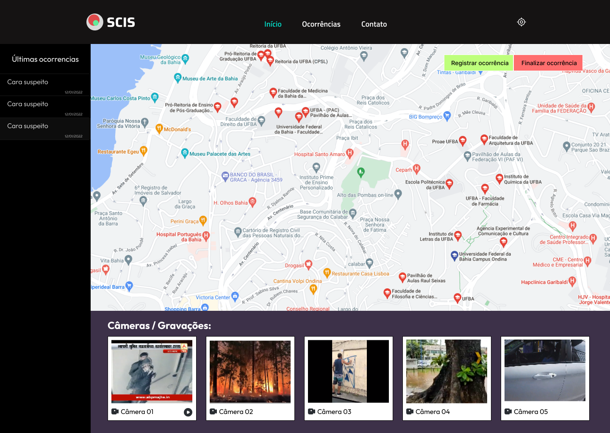
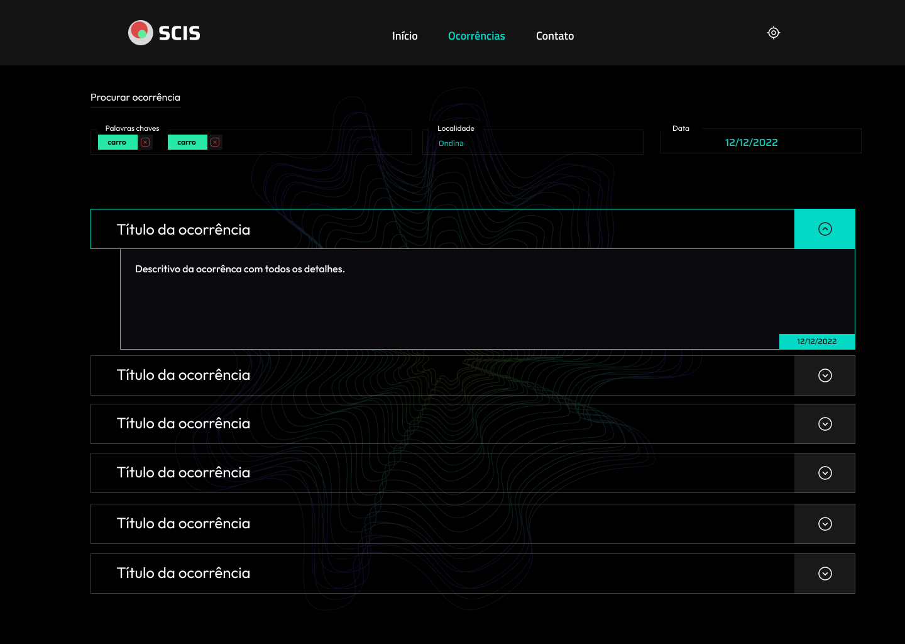

# CSIS - Painel de Monitoramento de Ocorrências de Vigilância Pública

## Introdução

<p>Em parceria com o Secretária de Segurança Pública o Grupo FORMAS por meio dessa </p>


# Telas:

##### Ínicio:


##### Lista de Ocorrências:


##### Detalhamento de Ocorrências:


# Link do Artigo
[Artigo no LateX](https://pt.overleaf.com/read/zxgjqgkzgwgn)


# Execute a aplicação:

```bash
npm run dev
# or
yarn dev
```


Desenvolvido por [Antonio Santana](santana.antonio@ufba.br)